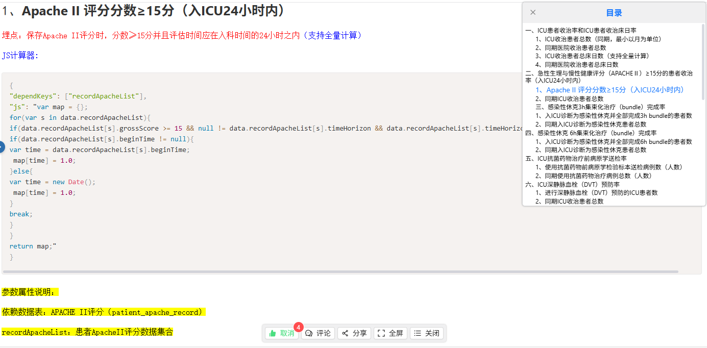

# wangeditor-dir-vue3

## 安装

```bash
npm install wangeditor-dir-vue3
```

## 使用方法

### 组件中使用

```vue
<template>
  <div>
    <WangeEditorDirVue3 
      :rootSelector="editorRef" 
      :containerStyle="containerStyle"
      :activeStyle="activeStyle"
    />
  </div>
</template>

<script>
import { ref, onMounted } from 'vue'
//本人水平有限 暂未解决引入问题
'import WangeEditorDir from 'wangeditor-dir-vue3/src/wange-editor_dir_vue3.vue' '

export default {
  components: {
    WangeEditorDirVue3
  },
  setup() {
    const editorRef = ref(null)
    const containerStyle = {
      width: '300px',
      height: '400px',
      border: '1px solid #ccc'
    }
    const activeStyle = {
      color: 'red',
      fontWeight: 'bold'
    }

    onMounted(() => {
      // 获取 wangEditor 根元素
      editorRef.value = document.querySelector('.w-e-editor')
    })

    return {
      editorRef,
      containerStyle,
      activeStyle
    }
  }
}
</script>
```


## 组件属性

| 属性名 | 类型 | 描述 |
| --- | --- | --- |
| rootSelector | HTMLElement | wangEditor 编辑器内容区域根元素（必需） |
| indentSize | Number | 目录缩进间隔（默认：15px） |
| containerStyle | Object | 容器样式 |
| itemStyle | Object | 目录项样式 |
| headerStyle | Object | 头部样式 |
| activeStyle | Object | 激活状态样式 |

## 事件

| 事件名 | 描述 |
| --- | --- |
| close | 关闭目录时触发 |

## 插槽

| 插槽名 | 描述 |
| --- | --- |
| header | 自定义头部内容 |
| empty | 无数据时显示的内容 |


## 效果图
